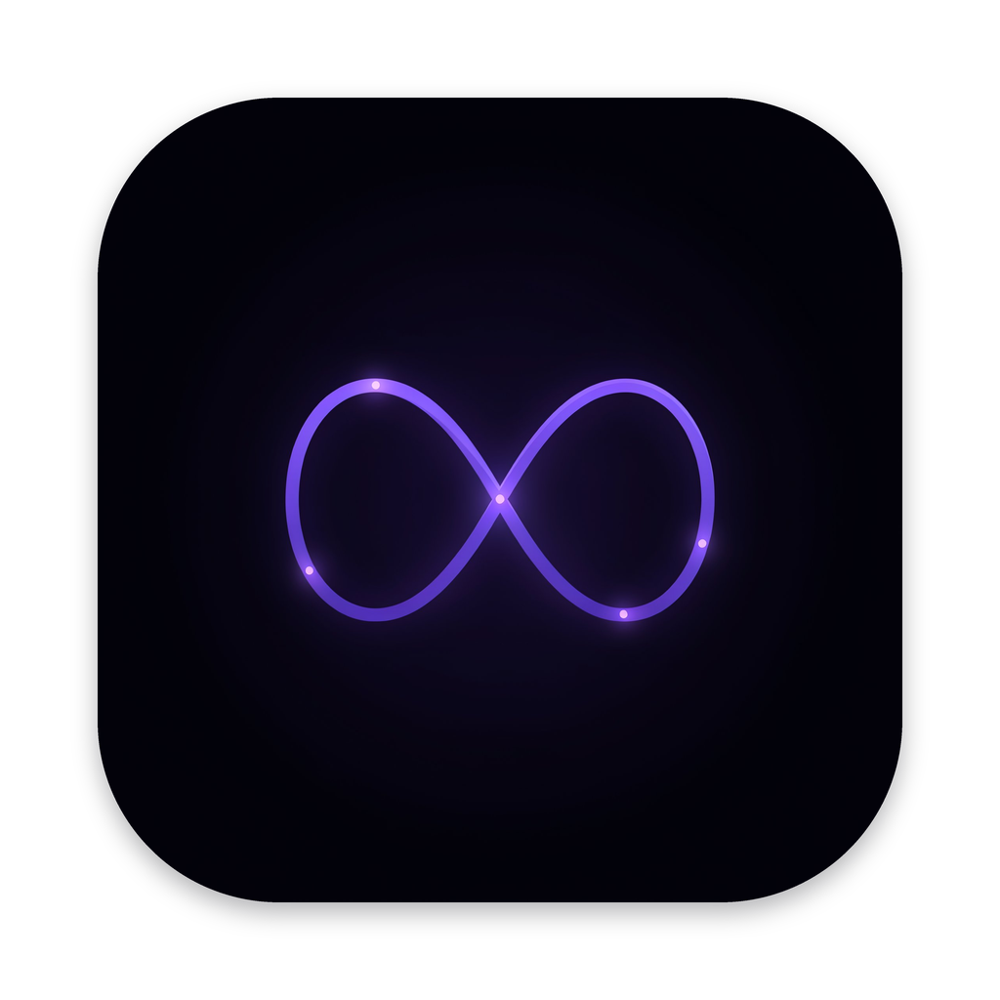
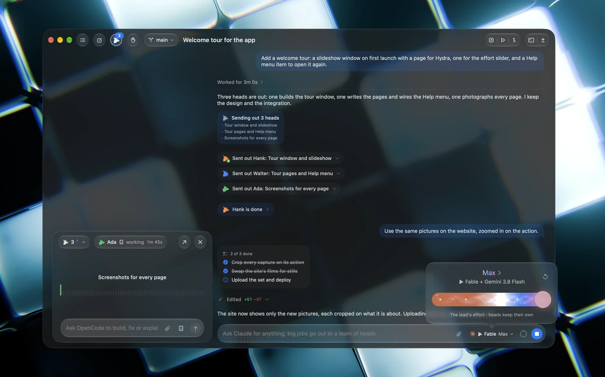
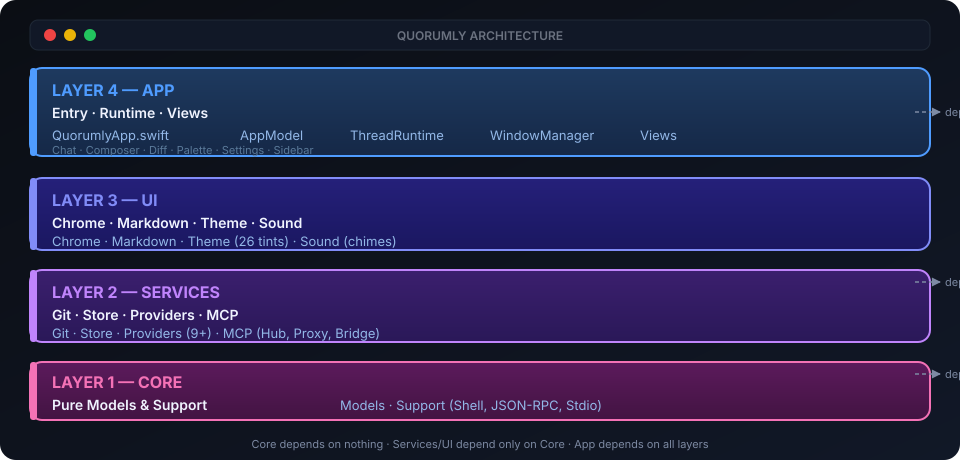
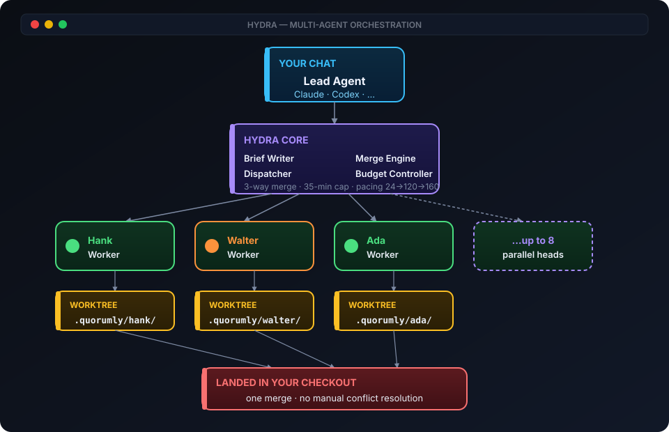
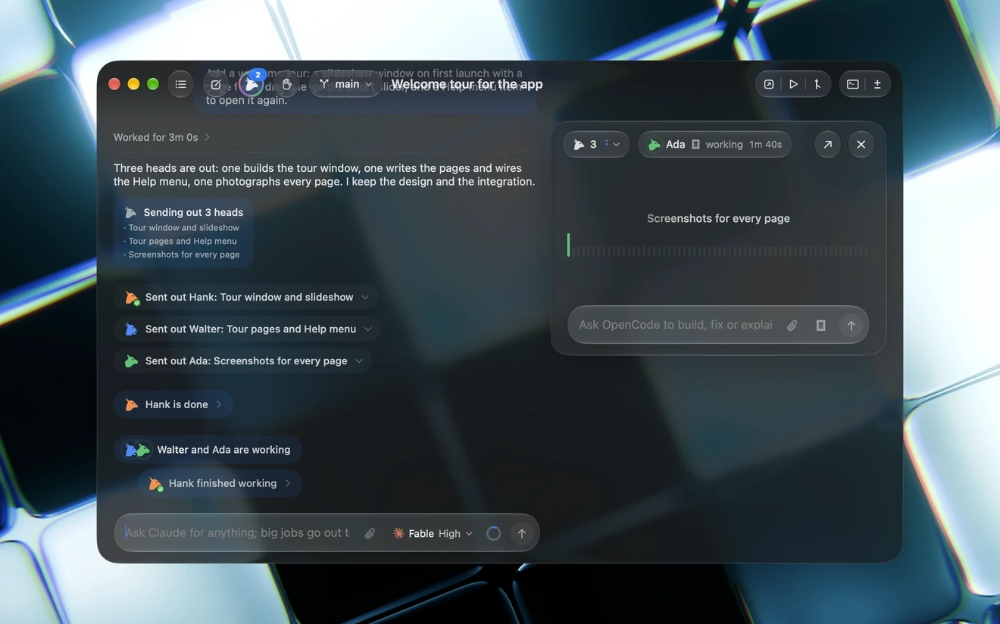
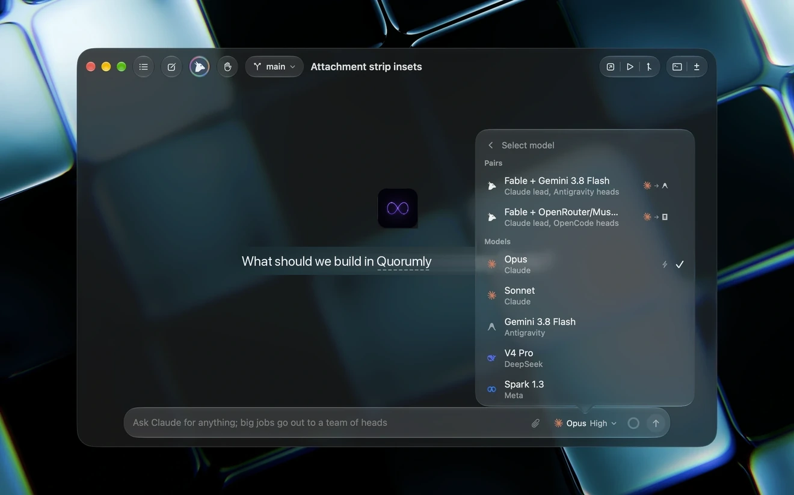
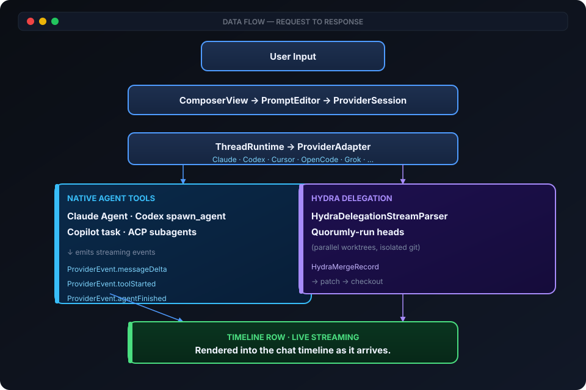
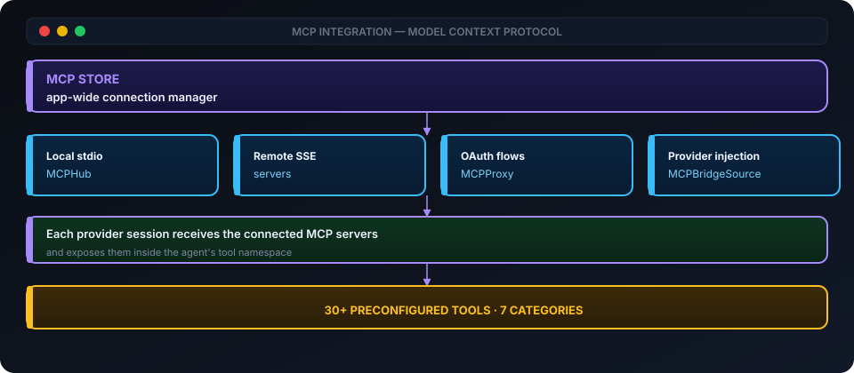
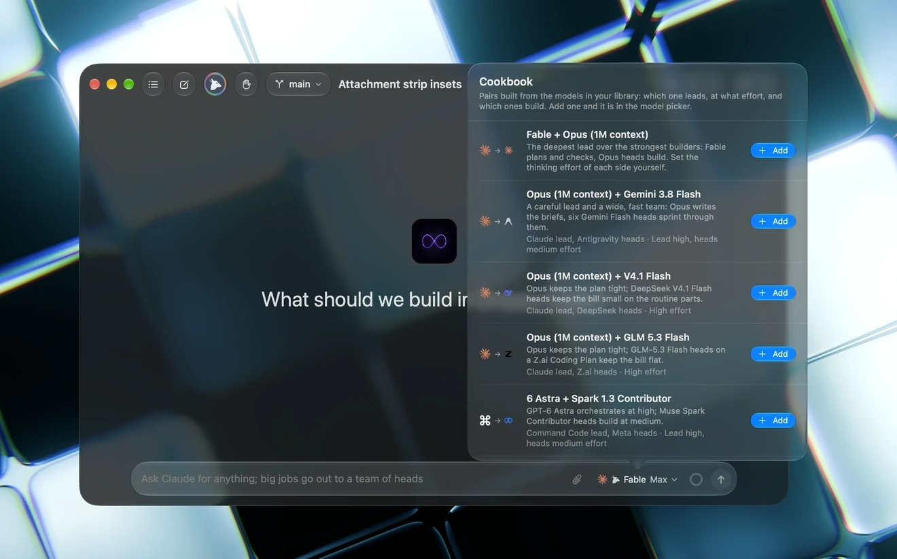

<div align="center">



# Quorumly for macOS

### Your coding agents. Native on the Mac.

<p>
  <a href="https://github.com/soumyachk101/Quorumly/releases/latest"></a>
  <a href="https://github.com/soumyachk101/Quorumly"></a>
  <a href="LICENSE"></a>
  <a href="https://github.com/soumyachk101/Quorumly"></a>
</p>

<p align="center">
  <i>One Liquid Glass window. Your subscriptions. No middleman. No cloud. No compromise.</i>
</p>

</div>

---

## What is Quorumly?

**Quorumly for macOS** is the official native macOS desktop application that unifies AI coding agents into one powerful, beautiful interface.

Built entirely in **Swift and SwiftUI** with Apple's **Liquid Glass** design language, Quorumly drives the coding agents you already have — on your own subscriptions, with zero markup, zero cloud, zero compromise.

> **Built by [Soumya Chakraborty](https://github.com/soumyachk101). For Mac, only Mac, forever.**

---

## Preview

<p align="center">
  
</p>

<p align="center">
  <sub>Hero · The Liquid Glass window with the assistant composer at the center of attention.</sub>
</p>

---

## Architecture

Quorumly provides dedicated native clients designed for each operating system:

<details open>
<summary><b>Native macOS App — Swift / SwiftUI (This Repository)</b></summary>

The dedicated macOS client. A single Xcode target built with Swift 6, SwiftUI, and the Liquid Glass design language. Uses only one external dependency: SwiftTerm for terminal emulation.

- 100% native SwiftUI with AppKit windowing
- Hardened runtime, signed and notarized
- Apple silicon (arm64) only, macOS 26+
- Four-layer architecture (`Core` → `Services` / `UI` → `App`)
- Zero telemetry, zero cloud sync, zero analytics
- Direct process spawning for CLI agents (Claude, Codex, Cursor, etc.)
- macOS Keychain for secure credential management

</details>

<details>
<summary><b>Windows & Linux Native App — Rust + GPUI</b></summary>

Available in the companion repository [Quorumly-rust](https://github.com/soumyachk101/Quorumly-rust):

- High-performance native Rust core and GPUI immediate-mode interface
- Dedicated installers and packages for Windows (`.exe` installer / `.zip`) and Linux (`.tar.gz` / `.AppImage` / `.deb`)
- Optional multi-device session sync powered by Loro CRDTs

</details>

### Application Architecture (Four-Layer Model)

The SwiftUI app follows a strict dependency hierarchy:

<p align="center">
  
</p>

<p align="center">
  <sub><b>Dependency rule:</b> Core depends on nothing. Services and UI depend only on Core. App depends on all layers.</sub>
</p>

---

### Hydra Multi-Agent System

Hydra is Quorumly's defining feature — parallel agent delegation with isolated worktrees:

<p align="center">
  
</p>

**How it works:**

1. **Lead** agent receives your task and writes briefs for each head
2. **Dispatcher** launches up to 8 heads in parallel, each in its own git worktree
3. **Heads** execute independently — different models, different providers, different effort levels
4. **Merge Engine** lands their work back as a single merge in your checkout
5. **Budget Controller** paces tool calls (24 pacing → 120 wrap-up → 160 hard stop) and enforces a 35-minute time limit

**Head types:**

- **Native heads:** Run inside the lead's session (Claude's Agent tool, Codex's `spawn_agent`, Copilot's task tool)
- **Delegated heads:** Separate sessions launched by Quorumly, typically when heads use a different provider than the lead

<p align="center">
  
</p>
<p align="center">
  <sub>Hydra heads running in parallel, each in their own worktree, with a brief and live status pane.</sub>
</p>

---

### Provider Ecosystem

Quorumly abstracts 10+ AI providers behind a unified protocol:

| Provider | Protocol | Auth | Key Feature |
|----------|----------|------|-------------|
| **Claude** (Anthropic) | stream-json + permission prompts | Terminal session | Native agent tools, reasoning effort |
| **Codex** (OpenAI) | App-server JSON-RPC | Terminal session | Banked resets, async task tracking |
| **Cursor** | Agent Client Protocol (ACP) | Terminal session | Plans, todos, permission requests |
| **OpenCode** | Agent Client Protocol (ACP) | Terminal session | Resume cursor versioning |
| **Grok** (xAI) | Agent Client Protocol (ACP) | Terminal session | ACP-based subagents |
| **Antigravity** (Google) | stream-json headless | Terminal session | Sign-in flow, subagent tools |
| **Copilot** (GitHub) | headless JSON-RPC | Terminal session | Custom agents, SDK protocol |
| **Command Code** | NDJSON events + session mod | Terminal session | One run per turn, approval gate |
| **Pi** (Inflection) | JSONL over stdio | Terminal session | Gate extension for approvals |
| **DeepSeek** | Native API (OpenAI-compatible) | API key (Keychain) | Pay-as-you-go credits |
| **Meta** | Native API (Muse Spark) | API key (Keychain) | Direct API integration |
| **Z.ai** (GLM) | Coding Plan API | API key (Keychain) | OpenAI-compatible |

<p align="center">
  
</p>
<p align="center">
  <sub>Live model switching — change provider and model mid-chat without losing context.</sub>
</p>

---

### Data Flow: Request to Response

<p align="center">
  
</p>

### MCP Integration

Quorumly includes a full Model Context Protocol hub:

<p align="center">
  
</p>

**30+ preconfigured tools** across Developer, Browser, Search, Work, Data, Cloud, and Knowledge categories.

---

## Features

### Multi-Agent Orchestration

- **Hydra parallel execution** — Lead agent delegates to up to 8 heads in parallel
- **Cross-provider pairs** — Claude lead with Gemini heads, Codex lead with Terra heads
- **Named head profiles** — Purpose-built configurations (quick, deep, visual)
- **Hydra Cookbook** — 9 curated pair recipes with effort presets
- **25 named head personas** — Hank, Walter, Ada, Otto, Nova, Remy, and more
- **Git worktree isolation** — Each head works in its own copy of the project
- **Automatic merging** — Heads' work lands as one merge with conflict handling
- **Live model switching** — Change provider/model mid-chat without losing context

<p align="center">
  
</p>
<p align="center">
  <sub>Hydra Cookbook · Curated model pairs, roles, and effort presets ready to launch.</sub>
</p>

### Chat & Threading

- **Projects and threads** in a collapsible sidebar with search
- **Thread modes** — Column, Floating, Panel (animated transitions)
- **Thread pinning, settling, archiving** — Settled threads dim until reopened
- **Follow-up queue** — Type while a turn runs; messages queue and send after
- **Reply quotes** — Quote part of a reply to answer in-place
- **Command palette** — ⌘K for threads, projects, actions
- **Keyboard shortcuts** — ⌘1-9 switch threads, ⌘B toggle sidebar, ⌘W archive

---

## Requirements

- Apple Silicon Mac (M1 / M2 / M3 / M4 or newer)
- macOS 26 or later
- At least one provider installed and signed in
- Git, plus `gh` or `glab` for pull requests

## Installation

1. Download `Quorumly.dmg` from the [Releases](https://github.com/soumyachk101/Quorumly/releases) page.
2. Double-click the `.dmg` file to open it.
3. Drag **Quorumly.app** into your `/Applications` folder.
4. Launch from Applications or Spotlight.

> If Gatekeeper flags an unnotarized development build: right-click → **Open**, or run:
> ```bash
> xattr -cr /Applications/Quorumly.app
> ```

## Building from Source

```bash
# Install dependencies
brew install xcodegen

# Generate Xcode project
xcodegen generate

# Open in Xcode
open Quorumly.xcodeproj
```

SwiftTerm is the only dependency, fetched automatically via Swift Package Manager.

## Release Process

```bash
# Build, sign, notarize, and package DMG
scripts/release.sh

# Publish to GitHub Releases
scripts/publish_release.sh
```

## License

MIT. See [LICENSE](LICENSE). The code is free to use; the name "Quorumly" and its icons are governed by [TRADEMARK.md](TRADEMARK.md).

---

<div align="center">

**Made with love by [Soumya Chakraborty](https://github.com/soumyachk101)**

Built in Swift. For Mac, only Mac, forever.

[⬆ Back to top](#quorumly-for-macos)

</div>
