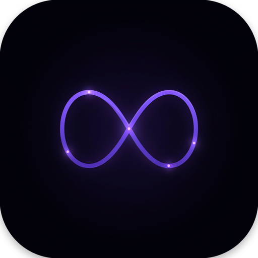

# Ensembyte

<p align="center">
  
</p>

<p align="center">
  <b>The open-source multi-agent coding client.</b><br/>
  Drive your AI coding agents locally — with style, speed, and zero telemetry.
</p>

<p align="center">
  <a href="https://github.com/soumyachk101/Ensembyte/actions/workflows/swift-macos.yml">
    
  </a>
  <a href="https://github.com/soumyachk101/Ensembyte/actions/workflows/rust-windows-linux.yml">
    
  </a>
  <a href="https://github.com/soumyachk101/Ensembyte/actions/workflows/release.yml">
    
  </a>
  
</p>

---

## What is Ensembyte?

Ensembyte is the unified open-source project that brings together **two blazing-fast native desktop clients** for driving AI coding agents right from your own machine. Both apps connect directly to the CLI tools you already have installed and signed into — **Claude Code, Codex, Cursor, OpenCode, Grok, Pi, Devin, Hermes, DeepSeek, Antigravity**, and more. Your subscriptions stay entirely yours. Your code never leaves your machine.

Built by **Soumya Chakraborty** with a focus on native performance, multi-agent orchestration, and a first-class desktop experience.

---

## Two Native Clients. One Vision.

To deliver uncompromising native speed, memory efficiency, and platform-perfect UI, Ensembyte ships as two dedicated clients — each handcrafted for its platform:

| | **Ensembyte for macOS** | **Ensembyte Desktop** |
|---|---|---|
| **Platform** | **macOS** (Apple silicon, macOS 26+) | **Windows & Linux** (x86_64, ARM64) |
| **Stack** | Swift 6 / SwiftUI + Liquid Glass | Rust 2024 / GPUI (GPU-accelerated) |
| **Source** | [`Ensembyte-swift/`](Ensembyte-swift/) | [`Ensembyte-rust/`](Ensembyte-rust/) |
| **Packages** | Signed & Notarized `.dmg` | `.exe` / `.zip`, `.tar.gz` / `.AppImage` / `.deb` |
| **Multi-Agent** | Hydra: Lead + parallel worktree heads | Dedicated local + synced sessions |
| **Design** | 26 tinted-glass themes, Liquid Glass | Minimalist dark/light, immediate-mode GPU |
| **Sync** | Local-first, hidden git checkpoints | Local-first, optional Loro CRDT sync |

> **macOS user?** → [Ensembyte for macOS](Ensembyte-swift/) — Liquid Glass, Hydra multi-agent, embedded terminal.
> **Windows / Linux user?** → [Ensembyte Desktop](Ensembyte-rust/) — GPU-accelerated, CRDT sync, lightweight.

---

## Key Capabilities

Both clients deliver the same powerful, keyboard-first experience — optimized for their respective platforms:

### Workspace & Streaming
Project and thread sidebars, search, pinning, and per-thread runtimes. Real-time streaming of **thoughts, reasoning, tool execution, terminal outputs, and file diffs** — all in one pane.

### Inline Permission Prompts
Answer approval requests, tool execution dialogs, and decision questions right in the streaming output — no terminal switching required.

### Diff for Every Turn
Automated git checkpoints let you inspect precise **line-by-line file modifications** across each model turn. Accept, reject, or navigate the full diff history.

### Model Context Protocol (MCP)
Preloaded with MCP servers for system tools, web search, browser automation, and knowledge bases. Configure custom transports (stdio, HTTP, SSE) with an OAuth flow.

### Spend & Quota Transparency
Live token expenditure and rolling rate-limit counters keep provider costs **visible and honest**.

### Local-First, Zero Telemetry
Everything runs on your machine. No cloud accounts, no data collection, no middleware. Your code, your subscriptions, your hardware.

---

## Supported Providers & Agents

Ensembyte connects to the CLI tools installed on your machine. Sign in once with each tool using your existing provider plan:

| Provider | CLI Tool | Protocol / Transport | macOS (Swift) | Windows & Linux (Rust) |
|---|---|---|---|---|
| **Claude** | `claude` | stream-json + permission prompts | ✅ | ✅ |
| **Codex** | `codex` | app-server JSON-RPC | ✅ | ✅ |
| **Cursor** | `cursor-agent` | Agent Client Protocol (ACP) | ✅ | ✅ |
| **Grok** | `grok` | Agent Client Protocol (ACP) | ✅ | ✅ |
| **Antigravity** | `agy` | stream-json headless | ✅ | ✅ |
| **Pi** | `pi` | JSONL over stdio | ✅ | ✅ |
| **OpenCode** | `opencode` | Agent Client Protocol (ACP) | ✅ | — |
| **Devin** | `devin` | local agent | — | ✅ |
| **Hermes** | `hermes` | local agent | — | ✅ |
| **DeepSeek** | `DEEPSEEK_API_KEY` | Native API (OpenAI-compatible) | ✅ | — |
| **Meta** | `MODEL_API_KEY` | Native API (Muse Spark) | ✅ | — |

---

## Hydra: The Multi-Agent Orchestration Engine *(macOS)*

Ensembyte for macOS ships with **Hydra** — a unique multi-agent system where one lead agent plans, delegates, and synthesizes work across up to 8 parallel heads:

```
           Lead Agent (orchestrator)
          /       |       |       \
    Head-1     Head-2   ...    Head-8
      │          │               │
   worktree   worktree    ...   worktree
      │          │               │
    result     result    ...   result
          \       |       |       /
           Merged Result (auto)
```

- **Lead agent** plans the work and delegates to parallel heads
- **Each head** operates in its own **isolated git worktree** — no conflicts, no race conditions
- **Automatic merge** — completed work is merged back with a single review step
- **Full visibility** — monitor progress, output, and status of every head in real-time

No more sequential "fix → run → fail → repeat" loops. Fire off 8 agents and let them do the heavy lifting in parallel.

---

## Architecture

Both implementations follow a **strict four-layer, one-way dependency model**:

### macOS — Swift App

```
Ensembyte/
├── Core/          Models, state primitives, pure support
│                  (no dependencies on upper layers)
├── Services/      Git, Store, Provider Adapters, MCP
│                  (depends only on Core)
├── UI/            Chrome, Themes, Markdown, Audio, Common Views
│                  (depends only on Core)
└── App/           Entry, Runtime, Windows, Feature Views
                   (depends on everything)
```

### Windows / Linux — Rust App

```
ensembyte/
├── core/              Models, state primitives, pure support
│                       (no dependencies on upper layers)
├── services/          Git, Store, Provider Adapters, MCP, Sync
│                       (depends only on core)
├── ui/                GPU-rendered views, themes, components
│                       (depends only on core)
└── app/               Entry, Runtime, Windows, Feature Views
                        (depends on everything)
```

> **Rule:** A file in `Core` never reaches into upper layers. New capabilities go into the lowest layer whose dependencies satisfy the requirements.

See [ARCHITECTURE.md](ARCHITECTURE.md) for the full technical specification.

---

## Installation

### Ensembyte for macOS

Official **signed and notarized** `.dmg` packages are available at:
👉 **[Ensembyte Releases](https://github.com/soumyachk101/Ensembyte/releases)**

1. Download **`Ensembyte.dmg`**
2. Mount the disk image and drag **Ensembyte.app** into `/Applications`
3. Launch from Applications or Spotlight

Or install via Homebrew (if a tap is available):

```bash
brew install --cask ensembyte
```

### Ensembyte Desktop (Windows / Linux)

Download the appropriate package for your platform from:
👉 **[Ensembyte Releases](https://github.com/soumyachk101/Ensembyte/releases)**

| Platform | Package |
|---|---|
| Windows x86_64 | `Ensembyte-Setup.exe` |
| Windows x86_64 (portable) | `ensembyte-windows-x86_64.zip` |
| Linux x86_64 | `ensembyte-linux-x86_64.tar.gz` |
| Linux aarch64 | `ensembyte-linux-aarch64.tar.gz` |
| Linux (AppImage) | `ensembyte-linux.AppImage` |
| Linux (deb) | `ensembyte-linux.deb` |

---

## Building from Source

### Ensembyte for macOS

**Requirements:**
- Mac with Apple Silicon (M1 / M2 / M3 / M4 or later)
- macOS Sequoia (macOS 15) or later
- Xcode 16+ with Swift 6 toolchain
- [XcodeGen](https://github.com/yonaskolb/XcodeGen) (`brew install xcodegen`)

**Build in Xcode:**
```bash
# Generate the project from project.yml
xcodegen generate

# Open the project
open Ensembyte.xcodeproj
```
Select the **Ensembyte** scheme and press **⌘B** to build or **⌘R** to run.

**Build from CLI:**
```bash
cd Ensembyte-swift
xcodebuild -project Ensembyte.xcodeproj \
  -scheme Ensembyte \
  -configuration Debug build
```

### Ensembyte Desktop (Windows / Linux)

**Requirements:**
- Rust 2024 toolchain (`rustup default 2024`)
- Node.js 20+ (for the edge/worker component)

**Build from CLI:**
```bash
cd Ensembyte-rust

# Linux (x86_64)
cargo build --release --target x86_64-unknown-linux-gnu

# Linux (aarch64)
cargo build --release --target aarch64-unknown-linux-gnu

# Windows (x86_64)
cargo build --release --target x86_64-pc-windows-msvc
```

See [`Ensembyte-rust/README.md`](Ensembyte-rust/README.md) for detailed build instructions.

---

## Packaging & Releases

### macOS — DMG Packaging

```bash
cd Ensembyte-swift
scripts/release.sh
# Produces: build.noindex/Ensembyte-<version>.dmg
```

The release pipeline builds a production archive, verifies code signatures, notarizes with Apple `notarytool`, and packages a styled DMG installer.

### Rust — Platform Packages

```bash
cd Ensembyte-rust
scripts/package-linux.sh      # Produces .tar.gz
scripts/package-windows.ps1   # Produces .exe installer
```

### Publishing

All releases are published to the designated release repository:

```bash
# macOS
gh release create v1.0.0 build.noindex/Ensembyte-1.0.0.dmg \
  --repo soumyachk101/Ensembyte \
  --title "v1.0.0"

# Linux / Windows
gh release create v1.0.0 \
  dist/ensembyte-linux-x86_64.tar.gz \
  dist/Ensembyte-Setup.exe \
  --repo soumyachk101/Ensembyte \
  --title "v1.0.0"
```

---

## Repository Structure

```
Ensembyte/
├── Ensembyte-swift/          # macOS client — Swift 6 / SwiftUI / Liquid Glass
│   ├── Ensembyte/
│   │   ├── Core/            # Models, state, pure support
│   │   ├── Services/        # Git, Store, Provider Adapters, MCP
│   │   ├── UI/              # Chrome, Themes, Markdown, Audio, Common
│   │   └── App/             # Entry, Runtime, Windows, Feature Views
│   ├── Resources/           # Bundled assets
│   ├── scripts/             # Release automation
│   └── release/             # DMG packaging, signing, notarization
│
├── Ensembyte-rust/           # Windows/Linux client — Rust 2024 / GPUI
│   ├── crates/
│   │   ├── core/            # Models, state, pure support
│   │   ├── services/        # Git, Store, Providers, MCP, Sync
│   │   ├── ui/              # GPU-rendered views, themes
│   │   └── app/             # Entry, Runtime, Windows, Feature Views
│   ├── apps/ensembyte/       # The binary
│   ├── edge/                # Cloudflare Worker + Durable Objects (sync)
│   ├── scripts/             # Packaging scripts
│   └── dist/                # Platform distribution assets
│
├── website/                 # Marketing site & documentation
│   └── assets/app/          # Screenshots & media
│
├── ARCHITECTURE.md          # Full technical specification
├── CONTRIBUTING.md          # Contributor guidelines
├── CHANGELOG.md             # Release history
├── LICENSE                  # MIT License
└── AGENTS.md                # Agent workflow instructions
```

---

## Technology

### macOS Client

| Technology | Role |
|---|---|
| Swift 6 | Language — strict concurrency, full memory safety |
| SwiftUI | UI framework — declarative, reactive, Liquid Glass |
| SwiftTerm | Embedded terminal emulation |
| Hydra | Multi-agent orchestration engine |
| Liquid Glass | Apple's native design language — glassmorphism, vibrancy |
| Keychain Services | Secure credential storage |
| MCP (Swift) | Model Context Protocol integration |

### Rust Client

| Technology | Role |
|---|---|
| Rust 2024 | Language — zero-cost abstractions, memory safety |
| GPUI | Immediate-mode GPU-accelerated UI framework |
| Loro CRDT | Conflict-free Replicated Data Types for multi-device sync |
| Cloudflare Durable Objects | Edge sync infrastructure |
| MCP (Rust) | Model Context Protocol integration |
| Tokio | Async runtime |

---

## Design Philosophy

Ensembyte is built on three non-negotiable principles:

1. **Local-First** — Everything runs on your machine. No cloud accounts, no data leaving your disk, no telemetry. Your code, your control.
2. **Native Performance** — SwiftUI on Apple silicon, GPUI on Windows/Linux. No Electron. No webviews. No compromises. GPU-accelerated rendering, zero-copy data flow, and platform-perfect chrome.
3. **Keyboard-First** — Every action has a keyboard shortcut. Ensembyte is built for developers who live in the terminal and want a UI that gets out of their way.

---

## The Team

Ensembyte is designed, developed, and maintained by **Soumya Chakraborty** ([@soumyachk101](https://github.com/soumyachk101)).

It is built upon incredible open-source foundations:

| Component | Project | License |
|---|---|---|
| Terminal Emulation | [SwiftTerm](https://github.com/migueldeicaza/SwiftTerm) by Miguel de Icaza | MIT |
| GPUI Toolkit | [GPUI / Zed](https://github.com/zed-industries/zed) by Zed Industries | GPL / Apache 2.0 |
| CRDT Sync | [Loro](https://github.com/loro-dev/loro) by Loro Dev | MIT / Apache 2.0 |
| Pulse Indicators | Ported from [Zeron](https://github.com/zeronsh/zeron) by Wing | MIT |
| Icons | [Lucide](https://lucide.dev) | ISC |

See [`THIRD_PARTY_NOTICES.md`](THIRD_PARTY_NOTICES.md) for complete attributions.

---

## Contributing

Ensembyte is open source under the **MIT License** and actively welcomes contributions.

1. **Read the Docs** — Study [`ARCHITECTURE.md`](ARCHITECTURE.md) and the README of the subproject you want to develop ([`Ensembyte-swift/`](Ensembyte-swift/) or [`Ensembyte-rust/`](Ensembyte-rust/))
2. **Open an Issue** — For new features or significant changes, open a GitHub Issue first to align on design
3. **Keep PRs Focused** — One concern per PR (bugfix, enhancement, refactoring)
4. **Follow Guidelines** — Adhere to our [Code of Conduct](CODE_OF_CONDUCT.md) and [Contributing Guide](CONTRIBUTING.md)
5. **Sign Off** — All commits must include `Co-Authored-By: Claude Fable 5 <noreply@anthropic.com>`

> The macOS app uses **worktrees for all experimental work**. See [`AGENTS.md`](AGENTS.md) for the workflow.

---

## Changelog

See [`CHANGELOG.md`](CHANGELOG.md) for the full release history.

**Latest:** Ensembyte v1.0 — macOS Liquid Glass client with Hydra multi-agent orchestration, embedded terminal, 26 themes, and full MCP integration.

---

## License

Licensed under the **MIT License**. See [LICENSE](LICENSE) for full terms.

Copyright © Soumya Chakraborty ([@soumyachk101](https://github.com/soumyachk101)).
