# Quorumly

<p align="center">
  
</p>

<p align="center">
  
  
  
  
  
  
  
</p>

<p align="center">
  <a href="https://github.com/soumyachk101/Quorumly/releases">⬇ Download</a>
  &nbsp;·&nbsp;
  <a href="https://quorumly.org">🌐 Website</a>
  &nbsp;·&nbsp;
  <a href="https://github.com/soumyachk101/Quorumly/blob/main/CONTRIBUTING.md">🤝 Contributing</a>
</p>

<p align="center">
  <b>The open-source multi-agent coding client.</b><br/>
  Drive your AI coding agents locally — with style, speed, and zero telemetry.
</p>

---

## What is Quorumly?

Quorumly is the unified open-source project that brings together **two blazing-fast native desktop clients** for driving AI coding agents right from your own machine. Both apps connect directly to the CLI tools you already have installed and signed into — **Claude Code, Codex, Cursor, OpenCode, Grok, Pi, Devin, Hermes, DeepSeek, Antigravity**, and more. Your subscriptions stay entirely yours. Your code never leaves your machine.

Built by **Soumya Chakraborty** with a focus on native performance, multi-agent orchestration, and a first-class desktop experience.

---

## Two Native Clients. One Vision.

To deliver uncompromising native speed, memory efficiency, and platform-perfect UI, Quorumly ships as two dedicated clients — each handcrafted for its platform:

| | **Quorumly for macOS** | **Quorumly Desktop** |
|---|---|---|
| **Platform** | **macOS** (Apple silicon, macOS 26+) | **Windows & Linux** (x86_64, ARM64) |
| **Stack** | Swift 6 / SwiftUI + Liquid Glass | Rust 2024 / GPUI (GPU-accelerated) |
| **Source** | [`Quorumly-swift/`](Quorumly-swift/) | [`Quorumly-rust/`](Quorumly-rust/) |
| **Packages** | Signed & Notarized `.dmg` | `.exe` / `.zip`, `.tar.gz` / `.AppImage` / `.deb` |
| **Multi-Agent** | 🔱 Hydra: Lead + parallel worktree heads | Dedicated local + synced sessions |
| **Design** | 26 tinted-glass themes, Liquid Glass | Minimalist dark/light, immediate-mode GPU |
| **Sync** | Local-first, hidden git checkpoints | Local-first, optional Loro CRDT sync |

> **macOS user?** → [Quorumly for macOS](Quorumly-swift/) — Liquid Glass, Hydra multi-agent, embedded terminal.
> **Windows / Linux user?** → [Quorumly Desktop](Quorumly-rust/) — GPU-accelerated, CRDT sync, lightweight.

---

## Screenshot Tour

Here's what Quorumly looks and feels like in action:

### 🖥 The Main Window

<p align="center">
  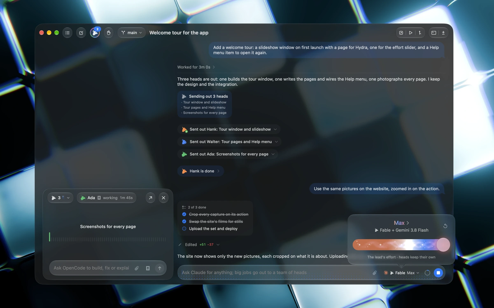
</p>

A beautiful Liquid Glass workspace with project sidebar, thread list, and streaming agent output — all in one view.

### 🔀 Multi-Agent Queue

<p align="center">
  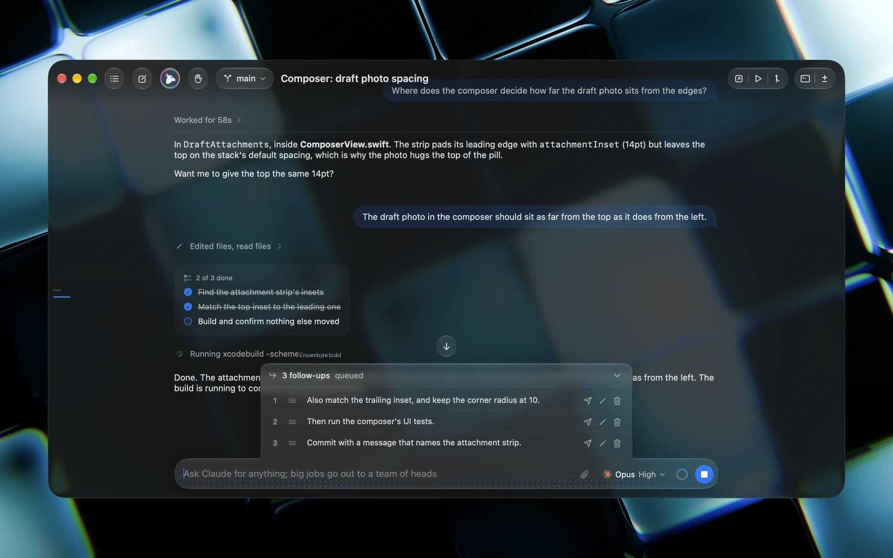
</p>

<span align="center">Monitor multiple agents running in parallel — each in its own isolated git worktree, with live status, progress, and merge results.</span>

### 🔍 Turn-by-Turn Diff Inspector

<p align="center">
  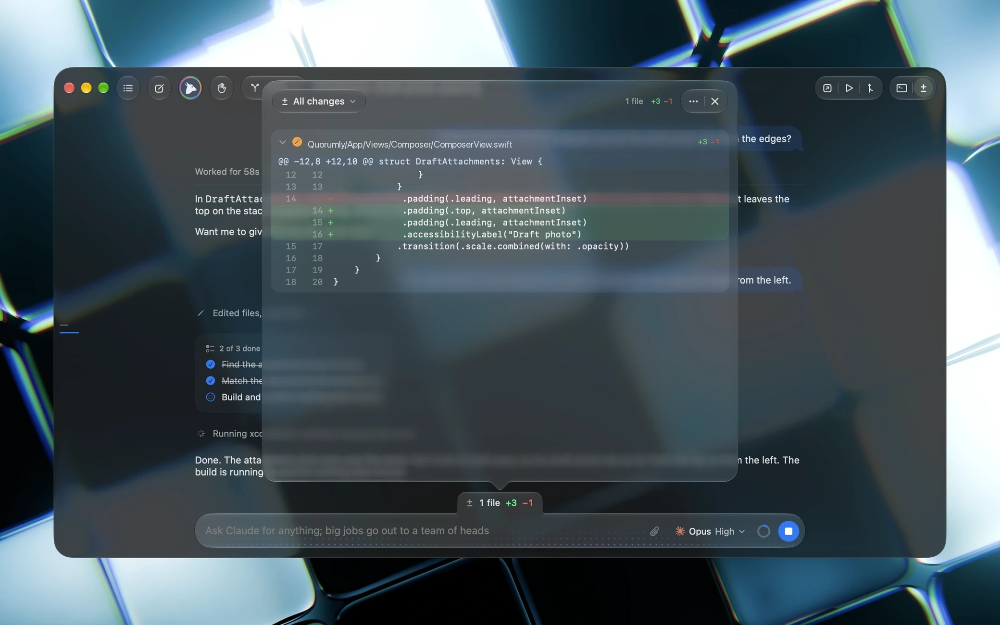
</p>

Every model turn produces a hidden git checkpoint. Inspect precise line-by-line file modifications, accept or reject hunks, and navigate the full timeline of changes.

### 💬 Inline Permission Prompts

<p align="center">
  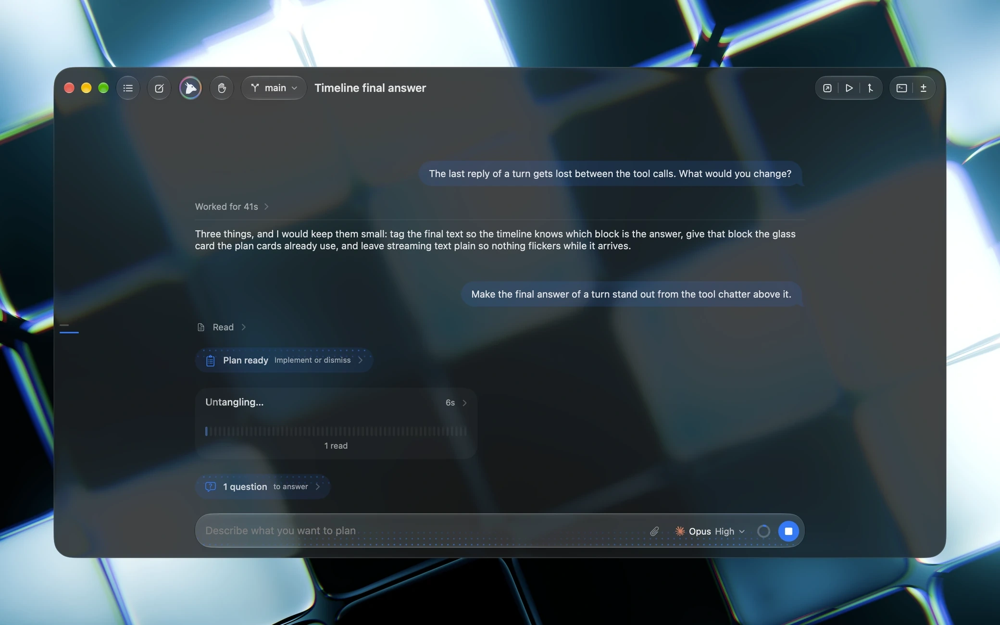
</p>

Answer approval requests, tool execution dialogs, and decision questions right in the streaming output — no terminal switching required.

### 🔔 Live Notifications

<p align="center">
  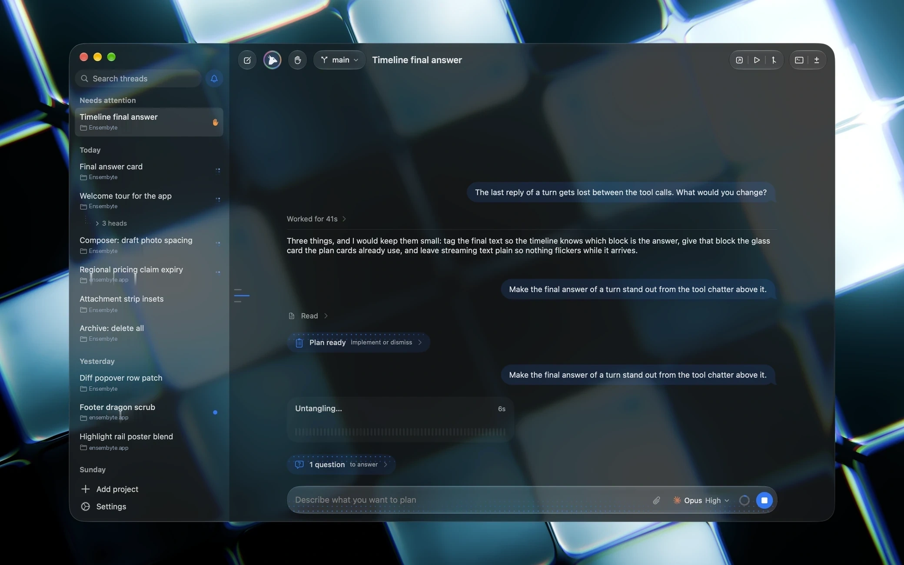
</p>

Get notified when a background agent completes, hits an error, or needs your attention — without losing your current context.

### 🎨 Theme Palette — 26 Liquid Glass Themes

<p align="center">
  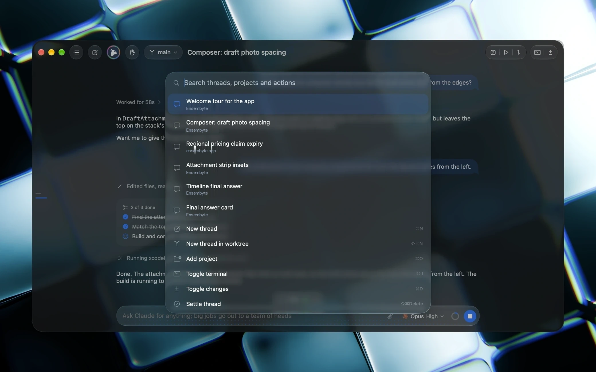
</p>

Twenty-six handcrafted tinted-glass color themes, from Midnight Ocean to Sunset Glow. Your workspace, your vibe.

### 🧵 Thread Management

<p align="center">
  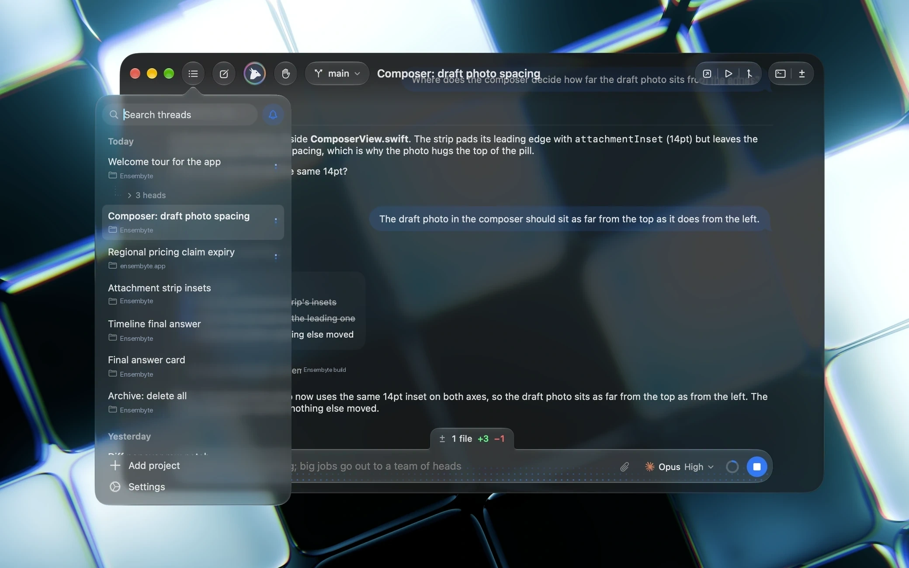
</p>

Organize conversations into threads, pin important ones, search across history, and pick up right where you left off.

### ⚡ Slash Commands

<p align="center">
  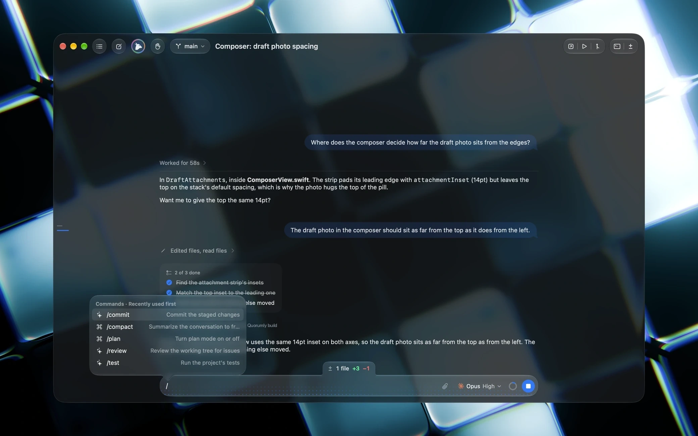
</p>

A powerful slash-command palette for quick actions — spawn agents, switch models, open files, manage worktrees, and more — all from the keyboard.

### 🛠 Plan Rendering & Tool Execution

<p align="center">
  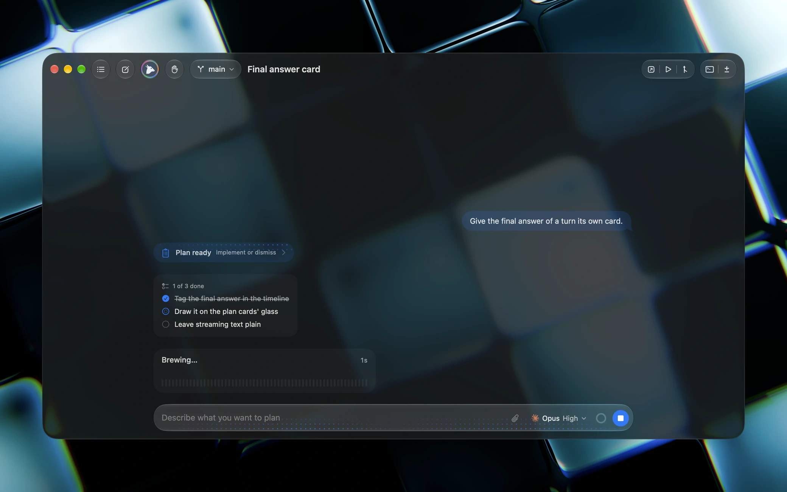
</p>

Watch your agent's thinking unfold in real-time with streaming markdown, tool-call plans, to-do lists, and reasoning disclosures.

### ⚙️ Provider & Plan Limits

<p align="center">
  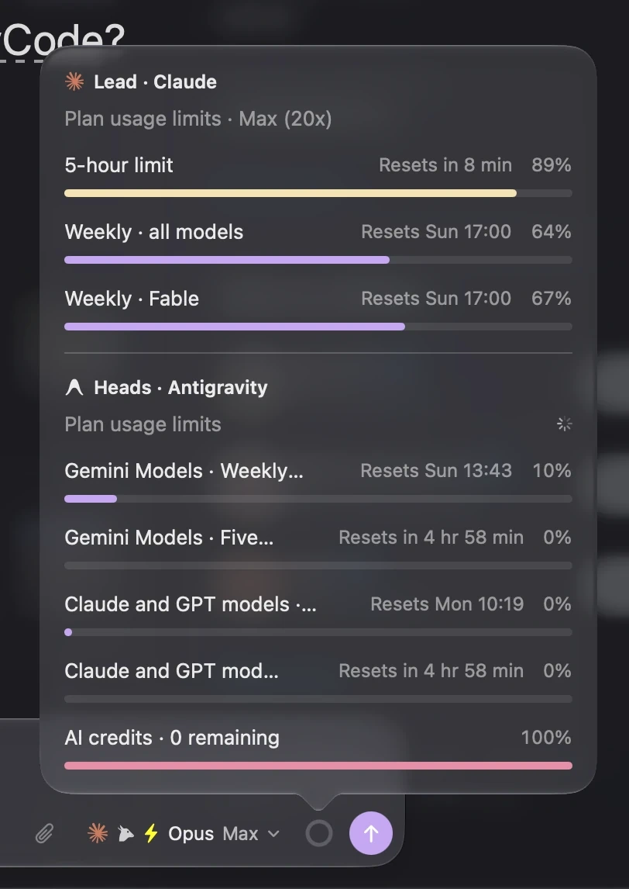
</p>

Live token expenditure, rolling rate-limit counters, and provider quota transparency — so you always know where you stand.

### 🔄 Agent Switcher

<p align="center">
  
</p>

Instantly switch between coding agents, models, and sessions — your context and history preserved across every transition.

### 🎚 Model & Temperature Slider

<p align="center">
  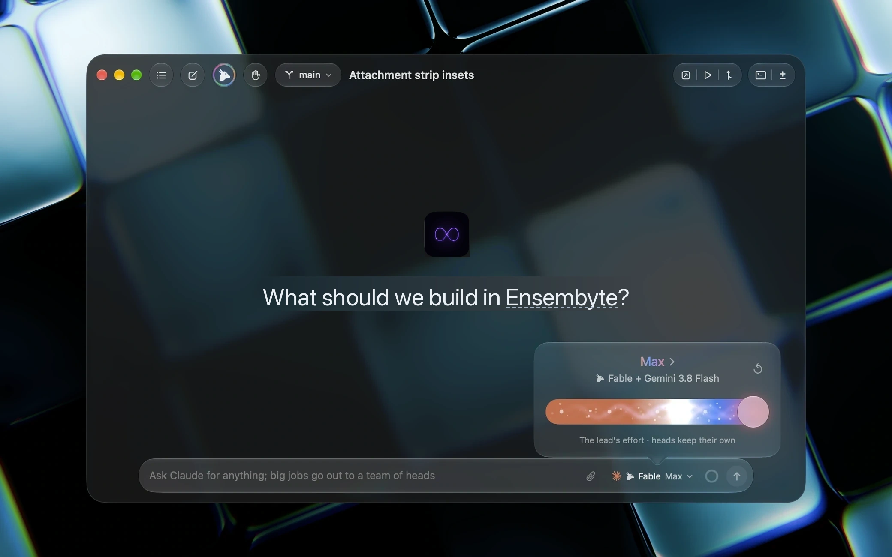
</p>

Fine-tune your model selection and temperature with a smooth, native macOS slider. Pick the right tool for the right job.

### 💡 Quoted Reasoning Blocks

<p align="center">
  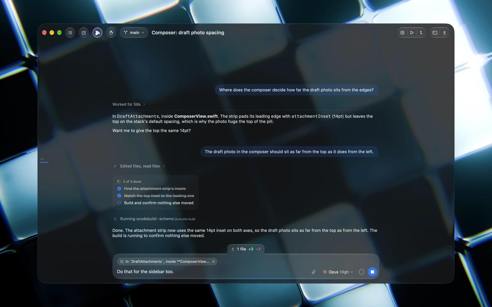
</p>

Collapsible, beautifully styled reasoning blocks that reveal the agent's chain of thought — clean, readable, and optionally expandable.

### 📋 Quick Recipes

<p align="center">
  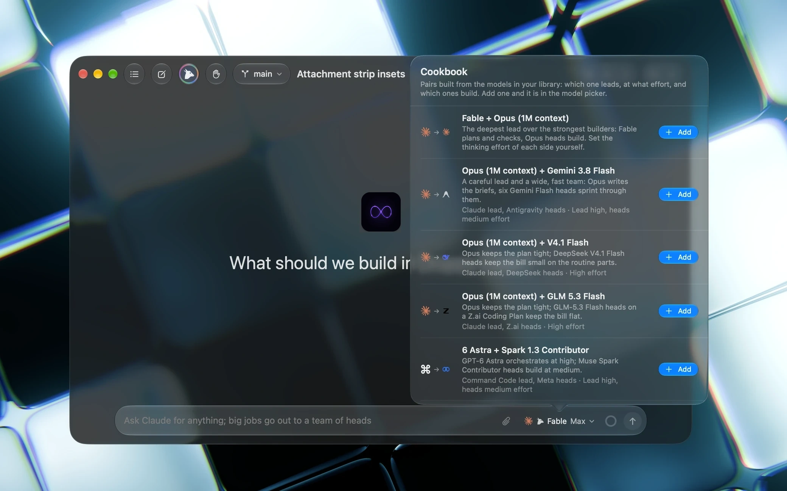
</p>

Pre-built workflow recipes for common tasks: code review, bug investigation, feature implementation, refactoring — one click to spawn a specialized agent.

### 📁 Sidebar & Project Explorer

<p align="center">
  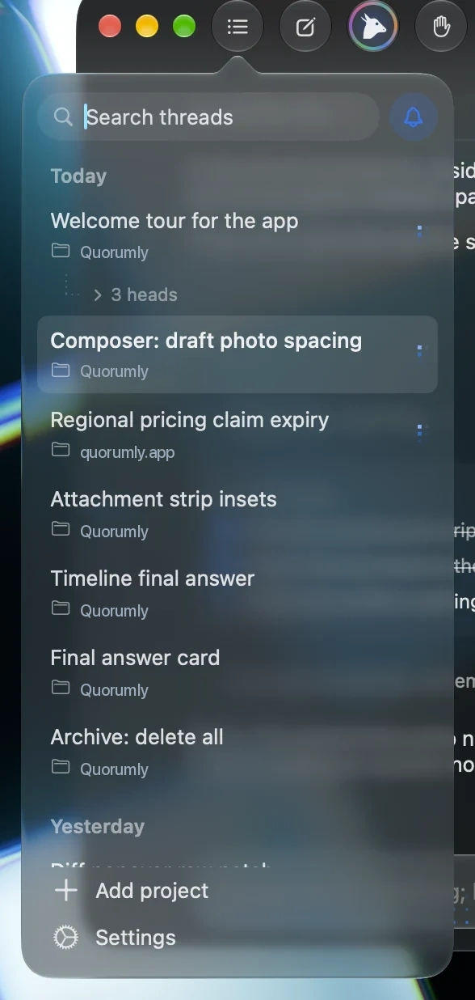
</p>

Resizable project sidebar with file trees, worktree indicators, and context-aware quick actions.

---

## Key Capabilities

Both clients deliver the same powerful, keyboard-first experience — optimized for their respective platforms:

### 🔱 One Workspace, Any Agent
Project and thread sidebars, search, pinning, and per-thread runtimes. Real-time streaming of **thoughts, reasoning, tool execution, terminal outputs, and file diffs** — all in one pane.

### 🔒 Inline Permission Prompts
Answer approval requests, tool execution dialogs, and decision questions right in the stream without ever leaving Quorumly.

### 🔁 Diff for Every Turn
Automated git checkpoints let you inspect precise **line-by-line file modifications** across each model turn. Accept, reject, or navigate the full diff history.

### 🔌 Model Context Protocol (MCP)
Preloaded with MCP servers for system tools, web search, browser automation, and knowledge bases. Configure custom transports (stdio, HTTP, SSE) with an OAuth flow.

### 💰 Spend & Quota Transparency
Live token expenditure and rolling rate-limit counters keep provider costs **visible and honest**.

### 🔐 Local-First, Zero Telemetry
Everything runs on your machine. No cloud accounts, no data collection, no middleware. Your code, your subscriptions, your hardware.

---

## Supported Providers & Agents

Quorumly connects to the CLI tools installed on your machine. Sign in once with each tool using your existing provider plan:

| Provider | CLI Tool | Protocol / Transport | macOS (Swift) | Windows & Linux (Rust) |
|----------|----------|---------------------|:---:|:---:|
| **Claude** | `claude` | stream-json + permission prompts | ✅ | ✅ |
| **Codex** | `codex` | app-server JSON-RPC | ✅ | ✅ |
| **Cursor** | `cursor-agent` | Agent Client Protocol (ACP) | ✅ | ✅ |
| **Grok** | `grok` | Agent Client Protocol (ACP) | ✅ | ✅ |
| **Antigravity** | `agy` | stream-json headless | ✅ | ✅ |
| **Pi** | `pi` | JSONL over stdio | ✅ | ✅ |
| **OpenCode** | `opencode` | Agent Client Protocol (ACP) | ✅ | — |
| **Devin** | `devin` | local agent | — | ✅ |
| **Hermes** | `hermes` | local agent | — | ✅ |
| **DeepSeek** | `DEEPSEEK_API_KEY` | Native API (OpenAI-compatible) | ✅ | — |
| **Meta** | `MODEL_API_KEY` | Native API (Muse Spark) | ✅ | — |

---

## Hydra: The Multi-Agent Orchestration Engine *(macOS)*

Quorumly for macOS ships with **Hydra** — a unique multi-agent system where one lead agent plans, delegates, and synthesizes work across up to 8 parallel heads:

```
           Lead Agent (orchestrator)
          /       |       |       \
    Head-1     Head-2   ...    Head-8
      │          │               │
   worktree   worktree    ...   worktree
      │          │               │
    result     result    ...    result
          \       |       |       /
           Merged Result (auto)
```

- **Lead agent** plans the work and delegates to parallel heads
- **Each head** operates in its own **isolated git worktree** — no conflicts, no race conditions
- **Automatic merge** — completed work is merged back with a single review step
- **Full visibility** — monitor progress, output, and status of every head in real-time

No more sequential "fix → run → fail → repeat" loops. Fire off 8 agents and let them do the heavy lifting in parallel.

---

## Architecture

Both implementations follow a **strict four-layer, one-way dependency model**:

### macOS — Swift App

```
Quorumly/
├── Core/          Models, state primitives, pure support
│                  (no dependencies on upper layers)
├── Services/      Git, Store, Provider Adapters, MCP
│                  (depends only on Core)
├── UI/            Chrome, Themes, Markdown, Audio, Common Views
│                  (depends only on Core)
└── App/           Entry, Runtime, Windows, Feature Views
                   (depends on everything)
```

### Windows / Linux — Rust App

```
quorumly/
├── core/              Models, state primitives, pure support
│                       (no dependencies on upper layers)
├── services/          Git, Store, Provider Adapters, MCP, Sync
│                       (depends only on core)
├── ui/                GPU-rendered views, themes, components
│                       (depends only on core)
└── app/               Entry, Runtime, Windows, Feature Views
                        (depends on everything)
```

> **Rule:** A file in `Core` never reaches into upper layers. New capabilities go into the lowest layer whose dependencies satisfy the requirements.

See [ARCHITECTURE.md](ARCHITECTURE.md) for the full technical specification.

---

## Installation

### Quorumly for macOS

Official **signed and notarized** `.dmg` packages are available at:
👉 **[Quorumly Releases](https://github.com/soumyachk101/Quorumly/releases)**

1. Download **`Quorumly.dmg`**
2. Mount the disk image and drag **Quorumly.app** into `/Applications`
3. Launch from Applications or Spotlight

Or install via Homebrew (if a tap is available):

```bash
brew install --cask quorumly
```

### Quorumly Desktop (Windows / Linux)

Download the appropriate package for your platform from:
👉 **[Quorumly Releases](https://github.com/soumyachk101/Quorumly/releases)**

| Platform | Package |
|----------|---------|
| Windows x86_64 | `Quorumly-Setup.exe` |
| Windows x86_64 (portable) | `quorumly-windows-x86_64.zip` |
| Linux x86_64 | `quorumly-linux-x86_64.tar.gz` |
| Linux aarch64 | `quorumly-linux-aarch64.tar.gz` |
| Linux (AppImage) | `quorumly-linux.AppImage` |
| Linux (deb) | `quorumly-linux.deb` |

---

## Building from Source

### Quorumly for macOS

**Requirements:**
- Mac with Apple Silicon (M1 / M2 / M3 / M4 or later)
- macOS Sequoia (macOS 15) or later
- Xcode 16+ with Swift 6 toolchain
- [XcodeGen](https://github.com/yonaskolb/XcodeGen) (`brew install xcodegen`)

**Build in Xcode:**
```bash
# Generate the project from project.yml
xcodegen generate

# Open the project
open Quorumly.xcodeproj
```
Select the **Quorumly** scheme and press **⌘B** to build or **⌘R** to run.

**Build from CLI:**
```bash
cd Quorumly-swift
xcodebuild -project Quorumly.xcodeproj \
  -scheme Quorumly \
  -configuration Debug build
```

### Quorumly Desktop (Windows / Linux)

**Requirements:**
- Rust 2024 toolchain (`rustup default 2024`)
- Node.js 20+ (for the edge/worker component)

**Build from CLI:**
```bash
cd Quorumly-rust

# Linux (x86_64)
cargo build --release --target x86_64-unknown-linux-gnu

# Linux (aarch64)
cargo build --release --target aarch64-unknown-linux-gnu

# Windows (x86_64)
cargo build --release --target x86_64-pc-windows-msvc
```

See [`Quorumly-rust/README.md`](Quorumly-rust/README.md) for detailed build instructions.

---

## Packaging & Releases

### macOS — DMG Packaging

```bash
cd Quorumly-swift
scripts/release.sh
# Produces: build.noindex/Quorumly-<version>.dmg
```

The release pipeline builds a production archive, verifies code signatures, notarizes with Apple `notarytool`, and packages a styled DMG installer.

### Rust — Platform Packages

```bash
cd Quorumly-rust
scripts/package-linux.sh      # Produces .tar.gz
scripts/package-windows.ps1   # Produces .exe installer
```

### Publishing

All releases are published to the designated release repository:

```bash
# macOS
gh release create v1.0.0 build.noindex/Quorumly-1.0.0.dmg \
  --repo soumyachk101/Quorumly \
  --title "v1.0.0"

# Linux / Windows
gh release create v1.0.0 \
  dist/quorumly-linux-x86_64.tar.gz \
  dist/Quorumly-Setup.exe \
  --repo soumyachk101/Orbit-Code \
  --title "v1.0.0"
```

---

## Repository Structure

```
Quorumly/
├── Quorumly-swift/          # macOS client — Swift 6 / SwiftUI / Liquid Glass
│   ├── Quorumly/
│   │   ├── Core/            # Models, state, pure support
│   │   ├── Services/        # Git, Store, Provider Adapters, MCP
│   │   ├── UI/              # Chrome, Themes, Markdown, Audio, Common
│   │   └── App/             # Entry, Runtime, Windows, Feature Views
│   ├── Resources/           # Bundled assets
│   ├── scripts/             # Release automation
│   └── release/             # DMG packaging, signing, notarization
│
├── Quorumly-rust/           # Windows/Linux client — Rust 2024 / GPUI
│   ├── crates/
│   │   ├── core/            # Models, state, pure support
│   │   ├── services/        # Git, Store, Providers, MCP, Sync
│   │   ├── ui/              # GPU-rendered views, themes
│   │   └── app/             # Entry, Runtime, Windows, Feature Views
│   ├── apps/quorumly/       # The binary
│   ├── edge/                # Cloudflare Worker + Durable Objects (sync)
│   ├── scripts/             # Packaging scripts
│   └── dist/                # Platform distribution assets
│
├── website/                 # Marketing site & documentation
│   └── assets/app/          # Screenshots & media
│
├── ARCHITECTURE.md          # Full technical specification
├── CONTRIBUTING.md          # Contributor guidelines
├── CHANGELOG.md             # Release history
├── LICENSE                  # MIT License
└── AGENTS.md                # Agent workflow instructions
```

---

## Technology Highlights

### macOS Client

| Technology | Role |
|------------|------|
| **Swift 6** | Language — strict concurrency, full memory safety |
| **SwiftUI** | UI framework — declarative, reactive, Liquid Glass |
| **SwiftTerm** | Embedded terminal emulation |
| **Hydra** | Multi-agent orchestration engine |
| **Liquid Glass** | Apple's native design language — glassmorphism, vibrancy |
| **Keychain Services** | Secure credential storage |
| **MCP (Swift)** | Model Context Protocol integration |

### Rust Client

| Technology | Role |
|------------|------|
| **Rust 2024** | Language — zero-cost abstractions, memory safety |
| **GPUI** | Immediate-mode GPU-accelerated UI framework |
| **Loro CRDT** | Conflict-free Replicated Data Types for multi-device sync |
| **Cloudflare Durable Objects** | Edge sync infrastructure |
| **MCP (Rust)** | Model Context Protocol integration |
| **Tokio** | Async runtime |

---

## Design Philosophy

Quorumly is built on three non-negotiable principles:

1. **Local-First** — Everything runs on your machine. No cloud accounts, no data leaving your disk, no telemetry. Your code, your control.

2. **Native Performance** — SwiftUI on Apple silicon, GPUI on Windows/Linux. No Electron. No webviews. No compromises. GPU-accelerated rendering, zero-copy data flow, and platform-perfect chrome.

3. **Keyboard-First** — Every action has a keyboard shortcut. Quorumly is built for developers who live in the terminal and want a UI that gets out of their way.

---

## The Team

Quorumly is designed, developed, and maintained by **Soumya Chakraborty** ([@soumyachk101](https://github.com/soumyachk101)).

It is built upon incredible open-source foundations:

| Component | Project | License |
|-----------|---------|---------|
| **Terminal Emulation** | [SwiftTerm](https://github.com/migueldeicaza/SwiftTerm) by Miguel de Icaza | MIT |
| **GPUI Toolkit** | [GPUI / Zed](https://github.com/zed-industries/zed) by Zed Industries | GPL / Apache 2.0 |
| **CRDT Sync** | [Loro](https://github.com/loro-dev/loro) by Loro Dev | MIT / Apache 2.0 |
| **Pulse Indicators** | Ported from [Zeron](https://github.com/zeronsh/zeron) by Wing | MIT |
| **Icons** | [Lucide](https://lucide.dev) | ISC |

See [`THIRD_PARTY_NOTICES.md`](THIRD_PARTY_NOTICES.md) for complete attributions.

---

## Contributing

Quorumly is open source under the **MIT License** and actively welcomes contributions.

1. **Read the Docs** — Study [`ARCHITECTURE.md`](ARCHITECTURE.md) and the README of the subproject you want to develop ([`Quorumly-swift/`](Quorumly-swift/) or [`Quorumly-rust/`](Quorumly-rust/))
2. **Open an Issue** — For new features or significant changes, open a GitHub Issue first to align on design
3. **Keep PRs Focused** — One concern per PR (bugfix, enhancement, refactoring)
4. **Follow Guidelines** — Adhere to our [Code of Conduct](CODE_OF_CONDUCT.md) and [Contributing Guide](CONTRIBUTING.md)
5. **Sign Off** — All commits must include `Co-Authored-By: Claude Fable 5 <noreply@anthropic.com>`

> 💡 The macOS app uses **worktrees for all experimental work**. See [`AGENTS.md`](AGENTS.md) for the workflow.

---

## Changelog

See [`CHANGELOG.md`](CHANGELOG.md) for the full release history.

**Latest:** Quorumly v1.0 — macOS Liquid Glass client with Hydra multi-agent orchestration, embedded terminal, 26 themes, and full MCP integration.

---

## License

Licensed under the **MIT License**. See [LICENSE](LICENSE) for full terms.

Copyright © Soumya Chakraborty ([@soumyachk101](https://github.com/soumyachk101)).

---

<p align="center">
  Made with ❤️ by <a href="https://github.com/soumyachk101">Soumya Chakraborty</a>
  <br/>
  <a href="https://quorumly.org">quorumly.org</a> · <a href="https://github.com/soumyachk101/Quorumly">GitHub</a> · <a href="https://github.com/soumyachk101/Quorumly/releases">Releases</a>
</p>
